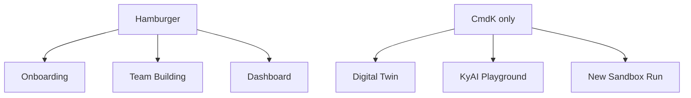
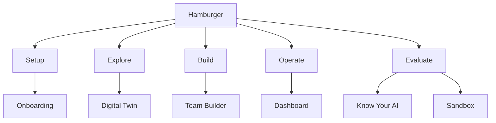
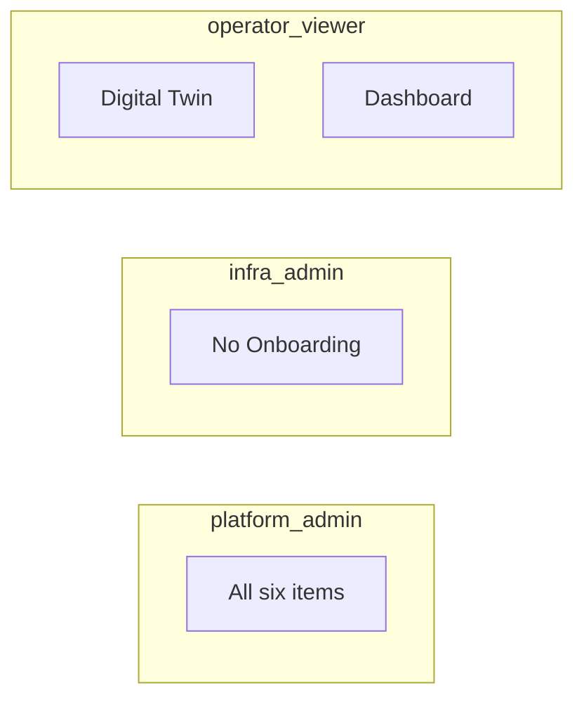

# Nav Wireframe Visuals (Option A)

Stakeholder handoff for Easy Navigation Clarity Phase 1.  
Code source of truth: `src/config/appNav.ts`, `src/components/CenterNavPanel/CenterNavPanel.tsx`.

No further app changes are required for this visual deliverable.

---

## Before — floating menu (3 items, no descriptions)

```text
┌────┐
│ ≡  │  hamburger
└────┘
   │
   ▼
┌──────────────────┐
│ [>] Onboarding   │
│ [o] Team Building│
│ [#] Dashboard    │
└──────────────────┘
```

Missing from menu (Cmd+K only): Digital Twin, Know Your AI, Sandbox.



---

## After — grouped menu with descriptions (shipped)

```text
┌────┐
│ ≡  │
└────┘
   │
   ▼
┌───────────────────────────────────────┐
│ SETUP                                 │
│ [>] Onboarding                        │
│     Import and discover infrastructure│
├───────────────────────────────────────┤
│ EXPLORE                               │
│ [#] Digital Twin                      │
│     View sites, racks, and assets     │
├───────────────────────────────────────┤
│ BUILD                                 │
│ [o] Team Builder                      │
│     Compose and deploy agent teams    │
├───────────────────────────────────────┤
│ OPERATE                               │
│ [#] Dashboard                         │
│     Live ops, teams, and reports      │
├───────────────────────────────────────┤
│ EVALUATE                              │
│ [?] Know Your AI                      │
│     Inspect and evaluate agent behavior│
│ [~] Sandbox                           │
│     Run sandbox evaluations           │
└───────────────────────────────────────┘
```

Active row keeps gradient treatment; description line uses muted secondary text (`--color-text-secondary`).



---

## Role-filtered views

```text
platform_admin     Setup + Explore + Build + Operate + Evaluate (all 6)
infra_admin        Explore + Build + Operate + Evaluate (no Onboarding)
operator / viewer  Explore + Operate only
                   (Digital Twin, Dashboard)
```



---

## Page chrome context (unchanged in Phase 1)

```text
┌─────────────────────────────────────────────────────────────┐
│ [≡]  Metrum  |  Page title          ... secondary controls  │
│                                                             │
│                     (page content)                          │
└─────────────────────────────────────────────────────────────┘
```

Dashboard sub-tabs stay in the shell (not in the hamburger):

```text
Command Center | Physical Systems | Agentic Team | Reporting
```

---

## Label map (before → after)

| Before | After |
|--------|-------|
| Team Building | Team Builder |
| KyAI Playground | Know Your AI |
| New Sandbox Run | Sandbox |
| Dashboard — Command Center (Cmd+K primary) | Dashboard (sub-tabs remain secondary Cmd+K entries) |

---

## Status

| Item | Status |
|------|--------|
| Shared `appNav` config | Done |
| CenterNavPanel groups + descriptions | Done |
| GlobalCommands label sync | Done |
| Role smoke tests | Done |
| Wireframe visual handoff | This document |

Review complete for Phase 1 navigation. Next optional step: Phase 2 (page titles / empty states).
